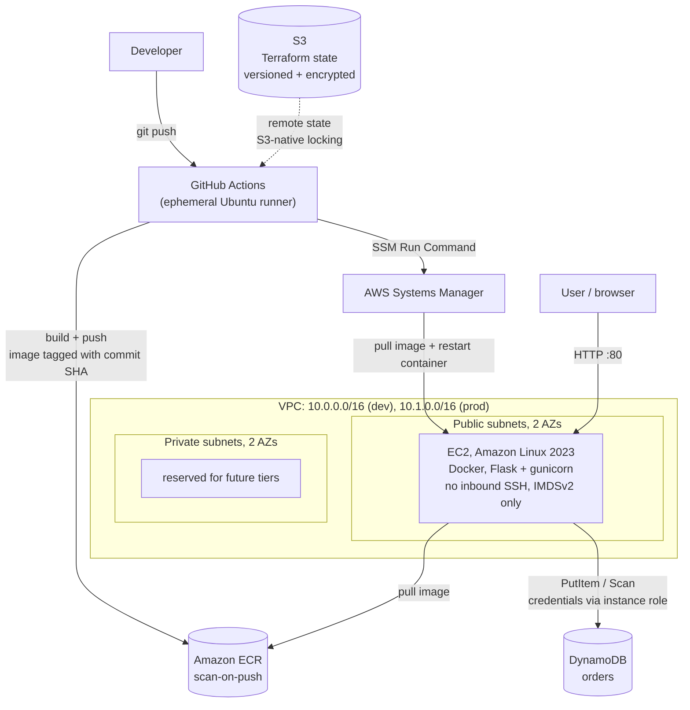

# Coffee Shop Platform


A secure, repeatable AWS foundation for a containerised web application, built entirely with
Terraform and deployed by a CI/CD pipeline.

The application itself (a coffee-shop menu and order form) is deliberately small. It exists as a
**vehicle** for the infrastructure: something real to containerise, deploy, persist data from, and
monitor. The interesting work is the platform underneath it.

As a cloud support engineer, I spend my days diagnosing other people's infrastructure. This project
is me turning that diagnostic experience into build experience: the environment I'd want a customer
to have started with.

---

## Architecture



**Three independent Terraform stacks**, separated by *lifecycle* rather than by environment:

| Stack | Contains | Lifecycle |
|---|---|---|
| `infra/backend` | S3 state bucket | Permanent: bootstrapped once, keeps local state |
| `infra/shared` | ECR repository, pipeline IAM identity | Permanent: shared by all environments |
| `infra/envs/{dev,prod}` | VPC, EC2, IAM role, DynamoDB | Ephemeral: destroyed between work sessions |

This split is deliberate. Putting the image registry in an environment stack would mean a routine
`terraform destroy` deleted the artifacts other environments depend on.

---

## Design decisions

### Security

- **No SSH, no inbound ports by default.** The security group's ingress list defaults to empty;
  access is via **SSM Session Manager**, which connects outbound-only. There is no key pair to
  manage, rotate, or leak, and no port 22 exposed to the internet.
- **IMDSv2 enforced** (`http_tokens = "required"`). IMDSv1's unauthenticated metadata endpoint is
  the mechanism behind several well-known SSRF credential-theft incidents. The hop limit is raised
  to 2 so containers can still reach instance metadata.
- **No credentials in the application.** The app calls DynamoDB through boto3 using the EC2
  instance role via instance metadata. No keys are baked into the image, passed as environment
  variables, or stored on disk.
- **Least privilege, scoped per resource.** The DynamoDB policy is an inline policy naming exactly
  one table ARN and four actions (`PutItem`, `GetItem`, `Query`, `Scan`). No `DeleteItem`, and no
  access to other tables. ECR push permissions in the pipeline are scoped to this repository's ARN.
- **Secure by default modules.** `allowed_http_cidrs` defaults to `[]`, so exposure is opt-in.
  `dev` permits only the operator's current IP (auto-detected at apply time); `prod` has no inbound
  rules at all.
- **Container hardening.** The image runs as a non-root user and serves via gunicorn rather than
  Flask's development server.
- **State protection.** The state bucket is versioned (recover from a corrupted state), encrypted
  at rest, and has public access fully blocked, since state files can contain sensitive values.

### Reproducibility

Every dependency is pinned, because unpinned dependencies make infrastructure non-reproducible:

| Dependency | How it's pinned |
|---|---|
| Terraform providers | `.terraform.lock.hcl`, committed |
| Python packages | exact `==` versions in `requirements.txt` |
| AMI selection | filter pinned to `al2023-ami-2023*-x86_64` |
| Container images | tagged with the **git commit SHA**, not `latest` |

The AMI one was learned the hard way. A looser filter (`al2023-ami-*-x86_64`) combined with
`most_recent = true` silently matched *minimal* AL2023 images, which ship no SSM Agent, so the
same unchanged code produced a different, broken instance depending on what AWS had published that
week.

### Pipeline

- **Build once, promote the same artifact.** A single ECR repository serves all environments, so
  the image tested in `dev` is byte-identical to the one that would reach `prod`. Rebuilding per
  environment allows them to drift.
- **Deployment via SSM Run Command**, not SSH. The pipeline never needs network access to the
  instance or a private key.
- **Builds on a clean ephemeral runner**, so artifacts never depend on a developer's local
  environment.

### Operational

- **S3-native state locking** (`use_lockfile = true`) rather than the deprecated DynamoDB lock
  table, which means one less resource and fewer IAM permissions needed for state access.
- **Line endings normalised to LF** via `.gitattributes`. CRLF in a shell script breaks on Linux
  with a cryptic `$'\r': command not found`.
- **`/health` endpoint** reports which storage backend is active, which makes a deploy verifiable
  and gives monitoring something to probe.

---

## Repository layout

```
.
├── app/                          # the Flask application (the vehicle)
│   ├── app.py                    # env-driven storage: DynamoDB, or in-memory locally
│   ├── templates/index.html
│   ├── requirements.txt          # pinned
│   └── Dockerfile                # non-root, gunicorn, layer-cached deps
├── infra/
│   ├── backend/                  # bootstrap: S3 state bucket (local state)
│   ├── shared/                   # ECR + pipeline IAM identity
│   ├── modules/
│   │   ├── vpc/                  # 2-AZ public/private subnets, IGW, routing
│   │   ├── iam/                  # EC2 instance role: SSM, ECR read, scoped DynamoDB
│   │   ├── ec2/                  # AL2023, hardened SG, IMDSv2, Docker via user_data
│   │   └── dynamodb/             # orders table
│   └── envs/
│       ├── dev/                  # 10.0.0.0/16, operator IP allowed on :80
│       └── prod/                 # 10.1.0.0/16, zero inbound
└── .github/workflows/deploy.yml  # build, push to ECR, deploy via SSM
```

Modules contain no environment-specific values. Each environment differs in exactly three places:
its remote state key, its `terraform.tfvars`, and any environment-specific behaviour (dev's IP
allowance versus prod's lockdown).

---

## Deploy it yourself

**Prerequisites:** an AWS account, Terraform >= 1.5, Docker, the AWS CLI configured, and a
globally-unique S3 bucket name.

```bash
# 1. Bootstrap the state backend (keeps local state, chicken-and-egg)
cd infra/backend
terraform init
terraform apply -var="state_bucket_name=<your-unique-bucket>"

# 2. Shared resources (ECR + pipeline identity)
#    Update the bucket name in the backend block first.
cd ../shared
terraform init
terraform apply

# 3. An environment
cd ../envs/dev
terraform init
terraform apply
terraform output          # instance id, public IP, orders table name
```

Access the instance without SSH:

```bash
aws ssm start-session --target <instance-id>
```

Run the app locally with no AWS dependency (falls back to in-memory storage):

```bash
cd app
docker build -t coffee-shop:local .
docker run --rm -p 8080:8080 -e APP_ENV=local coffee-shop:local
# http://localhost:8080  and  /health -> {"storage": "memory"}
```

---

## Teardown and cost

```bash
cd infra/envs/dev
terraform destroy
```

Destroy **only** the environment stacks. `backend` and `shared` are permanent and cost
approximately nothing (an empty state bucket and a ~50 MB image inside the ECR free tier).
EC2 is the only meaningful cost, which is why environments are torn down between sessions.

A single `terraform apply` rebuilds an environment from scratch; `terraform destroy` removes it
cleanly. That round-trip is the core correctness property of this project.

---

## Known limitations and roadmap

Documented honestly rather than omitted:

- **No load balancer yet.** Traffic reaches the instance directly. An Application Load Balancer
  across both AZs is the next planned piece of work. It also unlocks moving compute into the
  private subnets, which is where it belongs. Sequenced after the core platform because an ALB
  bills hourly and environments here are torn down between sessions.
- **Single instance, no autoscaling.** Pairs naturally with the ALB work above. The VPC is already
  multi-AZ, so this is an incremental change rather than a redesign.
- **`prod` is provisioned but not yet serving.** It has network, compute, and IAM, but the pipeline
  currently targets `dev` only.
- **The orders table shares the ephemeral environment lifecycle**, so `terraform destroy` deletes
  it. Acceptable for a learning project; in production a data store needs `deletion_protection`,
  `prevent_destroy`, point-in-time recovery, and ideally its own stack.
- **Pipeline authentication uses IAM access keys** stored as GitHub secrets. An OIDC provider and
  federated role are already provisioned in `infra/shared` as the intended end state; migrating
  removes stored credentials entirely. It is currently blocked on an `AssumeRoleWithWebIdentity`
  rejection where every claim and trust condition verifies correct. Notably, GitHub issues an
  **ID-based subject claim** (`repo:owner@<owner-id>/repo@<repo-id>:ref:...`) rather than the
  plain-name form most documentation shows.
- **No metrics or alerting yet.** Prometheus, Grafana, and CloudWatch alarms are the next phase.
- **DynamoDB reads use `Scan`**, which is fine at this scale but would need a GSI and `Query` under
  real load.

---

## Notes

Written as a portfolio project to practise production-shaped infrastructure: modular and reusable
IaC, multi-environment deployment, container delivery, and secure-by-default design.
