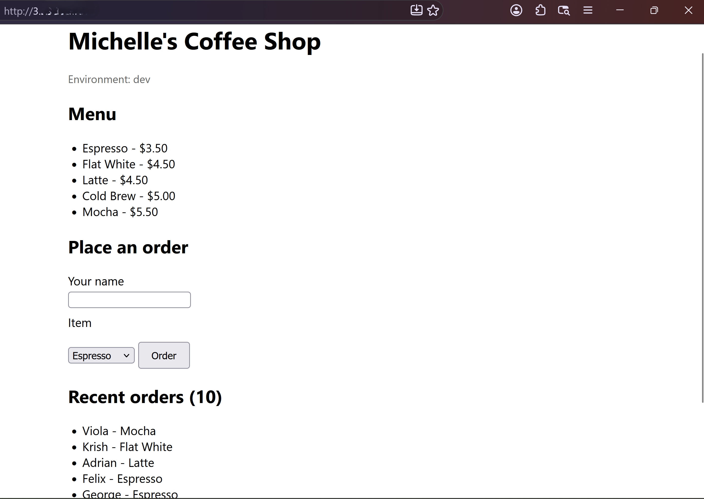
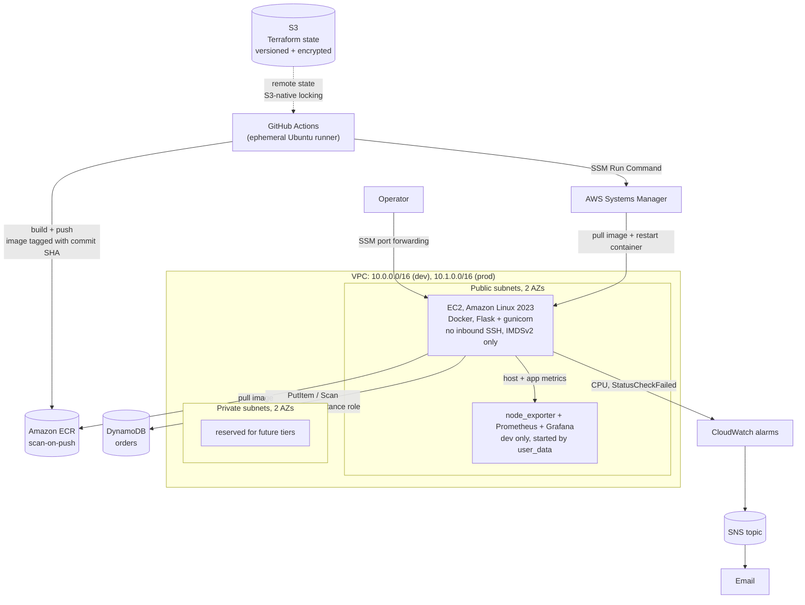
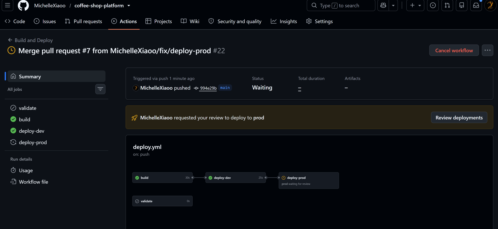
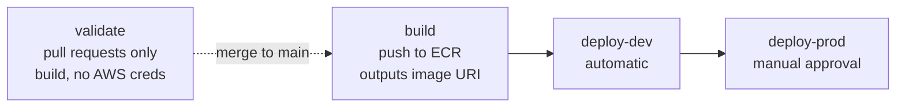
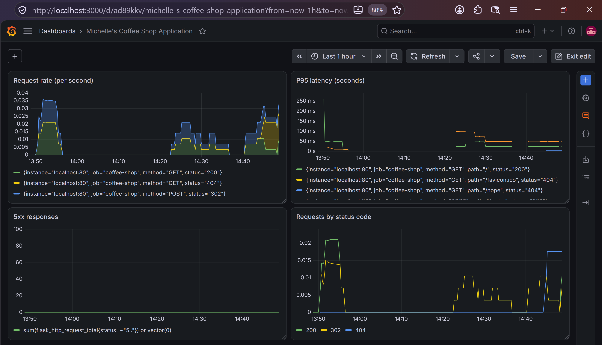
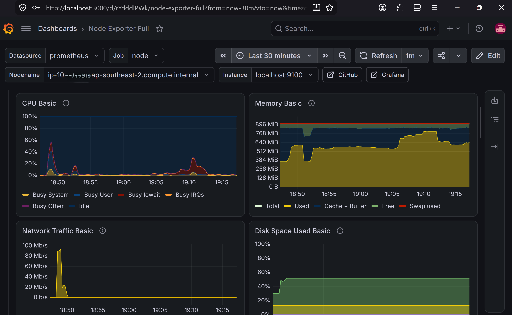
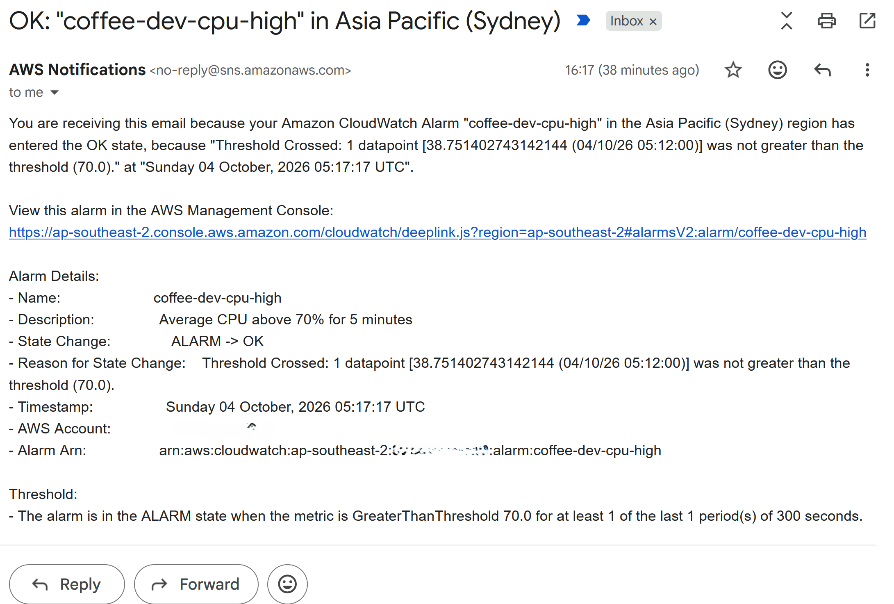
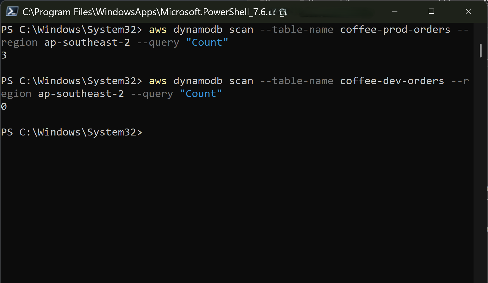

# Coffee Shop Platform


A secure, repeatable AWS foundation for a containerised web application, built entirely with
Terraform, deployed by a CI/CD pipeline with a gated production promotion, and monitored at both
the host and application layer.

The application itself (a coffee-shop menu and order form) is deliberately small. It exists as a
**vehicle** for the infrastructure: something real to containerise, deploy, persist data from, and
monitor. The interesting work is the platform underneath it.

As a cloud support engineer, I spend my days diagnosing other people's infrastructure. This project
is me turning that diagnostic experience into build experience: the environment I'd want a customer
to have started with.



*The app running on EC2, reached over an SSM port-forwarding tunnel. The `localhost` address in the
URL bar is the point: `prod` has no inbound rules at all.*

---

## Architecture



**Three independent Terraform stacks**, separated by *lifecycle* rather than by environment:

| Stack | Contains | Lifecycle |
|---|---|---|
| `infra/backend` | S3 state bucket | Permanent: bootstrapped once, keeps local state |
| `infra/shared` | ECR repository, pipeline IAM identity | Permanent: shared by all environments |
| `infra/envs/{dev,prod}` | VPC, EC2, IAM role, DynamoDB, alarms | Ephemeral: destroyed between work sessions |

This split is deliberate. Putting the image registry in an environment stack would mean a routine
`terraform destroy` deleted the artifacts other environments depend on.

---

## Design decisions

### Security

- **No SSH, no inbound ports by default.** The security group's ingress list defaults to empty;
  access is via **SSM Session Manager**, which connects outbound-only. There is no key pair to
  manage, rotate, or leak, and no port 22 exposed to the internet.
- **IMDSv2 enforced** (`http_tokens = "required"`). IMDSv1's unauthenticated metadata endpoint is
  the mechanism behind several well-known SSRF credential-theft incidents. The hop limit is raised
  to 2 so containers can still reach instance metadata.
- **No credentials in the application.** The app calls DynamoDB through boto3 using the EC2
  instance role via instance metadata. No keys are baked into the image, passed as environment
  variables, or stored on disk.
- **Least privilege, scoped per resource.** The DynamoDB policy is an inline policy naming exactly
  one table ARN and four actions (`PutItem`, `GetItem`, `Query`, `Scan`). No `DeleteItem`, and no
  access to other tables. ECR push permissions in the pipeline are scoped to this repository's ARN.
- **Secure by default modules.** `allowed_http_cidrs` defaults to `[]`, so exposure is opt-in.
  `dev` permits only the operator's current IP (auto-detected at apply time); `prod` has no inbound
  rules at all.
- **Container hardening.** The image runs as a non-root user and serves via gunicorn rather than
  Flask's development server.
- **State protection.** The state bucket is versioned (recover from a corrupted state), encrypted
  at rest, and has public access fully blocked, since state files can contain sensitive values.
- **Nothing sensitive in version control.** The alarm email address and the Grafana admin password
  are supplied as `TF_VAR_` environment variables rather than committed to `terraform.tfvars`.
  Neither variable declares a default, so a missing value stops the run instead of silently
  applying a stale one.

### Reproducibility

Every dependency is pinned, because unpinned dependencies make infrastructure non-reproducible:

| Dependency | How it's pinned |
|---|---|
| Terraform providers | `.terraform.lock.hcl`, committed |
| Python packages | exact `==` versions in `requirements.txt` |
| AMI selection | filter pinned to `al2023-ami-2023*-x86_64` |
| Container images | tagged with the **git commit SHA**, not `latest` |

The AMI one was learned the hard way. A looser filter (`al2023-ami-*-x86_64`) combined with
`most_recent = true` silently matched *minimal* AL2023 images, which ship no SSM Agent, so the
same unchanged code produced a different, broken instance depending on what AWS had published that
week.

A related habit: always `terraform plan -out=tfplan` and then apply the saved plan. A bare
`terraform apply` re-plans at apply time, so an input that changed in between can produce a
replacement nobody agreed to. That happened here once. A Grafana password that differed between
plan and apply quietly destroyed and rebuilt the instance.

### Pipeline

- **Build once, promote the same artifact.** A single ECR repository serves all environments, so
  the image running in `prod` is byte-identical to the one tested in `dev`. Rebuilding per
  environment allows them to drift.
- **Production is gated.** `deploy-prod` sits behind a GitHub Environment with a required reviewer
  and cannot start until `deploy-dev` has succeeded.
- **Deployment via SSM Run Command**, not SSH. The pipeline never needs network access to the
  instance or a private key.
- **Builds on a clean ephemeral runner**, so artifacts never depend on a developer's local
  environment.

### Operational

- **S3-native state locking** (`use_lockfile = true`) rather than the deprecated DynamoDB lock
  table, which means one less resource and fewer IAM permissions needed for state access.
- **Line endings normalised to LF** via `.gitattributes`. CRLF in a shell script breaks on Linux
  with a cryptic `$'\r': command not found`.
- **`/health` endpoint** reports which storage backend is active, which makes a deploy verifiable
  and gives monitoring something to probe.
- **Monitoring is codified, not hand-run.** The whole observability stack is rendered into
  `user_data` through `templatefile()`, conditional on `enable_monitoring`, so a fresh instance
  comes up already instrumented.

---

## Repository layout

```
.
├── app/                          # the Flask application (the vehicle)
│   ├── app.py                    # env-driven storage: DynamoDB, or in-memory locally
│   ├── templates/index.html
│   ├── requirements.txt          # pinned
│   └── Dockerfile                # non-root, gunicorn, layer-cached deps
├── infra/
│   ├── backend/                  # bootstrap: S3 state bucket (local state)
│   ├── shared/                   # ECR + pipeline IAM identity
│   ├── modules/
│   │   ├── vpc/                  # 2-AZ public/private subnets, IGW, routing
│   │   ├── iam/                  # EC2 instance role: SSM, ECR read, scoped DynamoDB
│   │   ├── ec2/                  # AL2023, hardened SG, IMDSv2, Docker via user_data
│   │   │   └── user_data.sh.tftpl    # app + optional monitoring stack
│   │   ├── dynamodb/             # orders table
│   │   └── alarms/               # SNS topic + subscription, CPU and status-check alarms
│   └── envs/
│       ├── dev/                  # 10.0.0.0/16, operator IP allowed on :80, monitoring on
│       └── prod/                 # 10.1.0.0/16, zero inbound, alarms only
├── docs/                         # screenshots
└── .github/workflows/deploy.yml  # validate, build, deploy-dev, deploy-prod
```

Modules contain no environment-specific values. Each environment differs in its remote state key,
its `terraform.tfvars`, and a small number of deliberate behavioural choices: dev's operator-IP
allowance against prod's lockdown, and dev's monitoring stack against prod's alarms-only setup.

---

## Deploy it yourself

**Prerequisites:** an AWS account, Terraform >= 1.5, Docker, the AWS CLI configured, the Session
Manager plugin for the AWS CLI, and a globally-unique S3 bucket name.

### Required environment variables

| Variable | Used by | Purpose |
|---|---|---|
| `TF_VAR_alert_email` | dev, prod | Address subscribed to the alarm SNS topic |
| `TF_VAR_grafana_admin_password` | dev | Grafana admin password |

```bash
# 1. Bootstrap the state backend (keeps local state, chicken-and-egg)
cd infra/backend
terraform init
terraform apply -var="state_bucket_name=<your-unique-bucket>"

# 2. Shared resources (ECR + pipeline identity)
#    Update the bucket name in the backend block first.
cd ../shared
terraform init
terraform apply

# 3. An environment
cd ../envs/dev
export TF_VAR_alert_email="you@example.com"
export TF_VAR_grafana_admin_password="..."
terraform init
terraform plan -out=tfplan
terraform apply tfplan
terraform output          # instance id, public IP, orders table name
```

Confirm the SNS subscription email when it arrives: the link in the email should be clicked and it opens a new webpage, where there is another "Confirm Subscription" button has to be clicked.

Access the instance without SSH:

```bash
aws ssm start-session --target <instance-id>
```

Or forward a local port to reach the app with no inbound rules at all:

```bash
aws ssm start-session \
  --target <instance-id> \
  --document-name AWS-StartPortForwardingSession \
  --parameters "portNumber=80,localPortNumber=8080" \
  --region ap-southeast-2
```

Keep that terminal open, since closing it drops the tunnel. Forwarding both environments to
different local ports (8080 for dev, 8081 for prod) lets you compare them side by side.

Run the app locally with no AWS dependency (falls back to in-memory storage):

```bash
cd app
docker build -t coffee-shop:local .
docker run --rm -p 8080:8080 -e APP_ENV=local coffee-shop:local
# http://localhost:8080  and  /health -> {"storage": "memory"}
```

---

## CI/CD



Four jobs in `.github/workflows/deploy.yml`:



**`validate`** runs on pull requests only. It builds the image and nothing else, with no AWS
credentials in scope. It is a required status check on `main`, and it deliberately has **no**
`paths` filter: a required check that never runs on documentation-only pull requests would block
them forever.

**`build`** runs on `main`, tags the image with the commit SHA, pushes to ECR, and emits the image
URI as a job output. Both deploy jobs consume that same output.

**`deploy-dev`** and **`deploy-prod`** locate the instance by its `Name` tag and deploy through SSM
Run Command: log in to ECR, pull, replace the container, report status. If no running instance is
found the job records a notice and passes, so the pipeline stays green when environments are
intentionally torn down.

`main` is protected: pull request required, direct pushes blocked including for administrators, and
`validate` must pass.

### Two bugs worth recording

`deploy-prod` originally declared `needs: deploy-dev` while still reading
`needs.build.outputs.image`. The `needs` context exposes outputs from **direct dependencies only**,
so the image URI silently resolved to an empty string. It stayed hidden for weeks, because the
deploy step is guarded on finding a running instance and `prod` never had one until the first real
end-to-end run. The fix is `needs: [build, deploy-dev]`.

The SSM result was also fetched with `|| true` and merely printed, so a container that failed to
start still reported a green job. Both deploy jobs now read the final invocation status and exit
non-zero on anything other than `Success`. A pipeline that cannot fail is not telling you anything.

---

## Observability

Two layers, split by what each is good at: Prometheus and Grafana for high-resolution
troubleshooting inside the instance, CloudWatch for alarms that survive the instance.

### Host and application metrics

`node_exporter` and a Prometheus container run alongside the app, all started by `user_data`. The
Flask app exposes application metrics through `prometheus-flask-exporter`, so Prometheus scrapes
two targets: one host-level, one app-level.

**Application dashboard**, built by hand on the golden-signals shape:



- Request rate per endpoint
- p95 latency, via `histogram_quantile` over the exporter's histogram buckets
- 5xx rate, using `sum(...) or vector(0)`
- Status-code breakdown with `sum by (status)`

That `or vector(0)` took a while to work out. An absent Prometheus series is not a zero value, so a
panel reading "No data" looks identical to a panel reading "no errors". The fallback makes a
healthy service visibly healthy. Testing it meant generating a real 500, which I did by pointing
`ORDERS_TABLE` at a table that does not exist.

**Host dashboard**, community dashboard 1860, imported unmodified:



The Grafana datasource is provisioned by Terraform, so the Prometheus connection is wired up on
first boot with no manual step. The dashboards themselves are still imported by hand. See
Limitations.

### Alarms

`infra/modules/alarms` creates an SNS topic, an email subscription, and two alarms per environment:
high CPU and `StatusCheckFailed`.



Three choices worth noting:

- `treat_missing_data = "notBreaching"`, so a destroyed environment does not leave an alarm stuck
  in `INSUFFICIENT_DATA`
- `ok_actions` is set, so recovery is notified as well as failure
- Alarms fire on state **transitions**, not on every breach. A sustained 90% CPU emits one
  notification, not one per period. Verifying the wiring with
  `aws cloudwatch set-alarm-state` is far quicker than generating real load

The alarms module was built while only `dev` existed, so for a while alerting covered dev and not
prod, which is precisely backwards. Both environments have it now.

### Environment isolation, verified



The same image runs in both environments and reads its configuration at runtime. Orders placed
through the prod tunnel appear only in `coffee-prod-orders`, which makes the `ORDERS_TABLE`
injection something I checked rather than assumed.

---

## Teardown and cost

```bash
cd infra/envs/prod && terraform destroy
cd ../dev          && terraform destroy
```

Destroy **only** the environment stacks. `backend` and `shared` are permanent and cost
approximately nothing (an empty state bucket and a ~50 MB image inside the ECR free tier).
EC2 is the only meaningful cost, which is why environments are torn down between sessions.
CloudWatch alarms and SNS email both sit inside the free tier at this scale.

A single `terraform apply` rebuilds an environment from scratch; `terraform destroy` removes it
cleanly. That round-trip is the core correctness property of this project.

A billing alarm was configured before any of this was built.

---

## Known limitations and roadmap

Documented honestly rather than omitted:

- **No load balancer yet.** Traffic reaches the instance directly. An Application Load Balancer
  across both AZs is the next planned piece of work. It also unlocks moving compute into the
  private subnets, which is where it belongs. Sequenced after the core platform because an ALB
  bills hourly and environments here are torn down between sessions.
- **Single instance, no autoscaling.** Pairs naturally with the ALB work above. The VPC is already
  multi-AZ, so this is an incremental change rather than a redesign.
- **Deploys cause brief downtime.** A `docker pull` and container replacement on a fixed instance.
  Rolling or blue/green deployment needs the load balancer and a second instance first.
- **Prometheus and Grafana run on `dev` only**, gated by `enable_monitoring`. `prod` gets
  CloudWatch alarms but no in-instance dashboards. A cost decision, not a design preference.
- **Grafana dashboards are not provisioned as code.** The datasource is codified; the dashboards
  are built through the UI, so they are lost when the environment is destroyed. Provisioning them
  from JSON files alongside the datasource is the obvious next step and the first thing I would
  fix.
- **SNS subscriptions need manual confirmation and do not survive `terraform destroy`.** Every
  recreated environment sends a fresh confirmation link that has to be clicked before alarms can
  reach anyone, which is a real weakness in an ephemeral-environment design. A chat webhook, or a
  long-lived topic promoted into `infra/shared`, would avoid it.
- **The orders table shares the ephemeral environment lifecycle**, so `terraform destroy` deletes
  it. Acceptable for a learning project; in production a data store needs `deletion_protection`,
  `prevent_destroy`, point-in-time recovery, and ideally its own stack.
- **Pipeline authentication uses IAM access keys** stored as GitHub secrets. An OIDC provider and
  federated role are already provisioned in `infra/shared` as the intended end state; migrating
  removes stored credentials entirely. It is currently blocked on an `AssumeRoleWithWebIdentity`
  rejection where every claim and trust condition verifies correct. Two genuine bugs were found and
  fixed along the way: a thumbprint taken from the leaf certificate rather than the CA, and a
  subject claim that GitHub now issues in **ID-based** form
  (`repo:owner@<owner-id>/repo@<repo-id>:ref:...`) rather than the plain-name form most
  documentation shows. Neither resolved it, so access keys were the pragmatic call and the root
  cause remains open.
- **No automated tests.** The pipeline proves the image builds. It does not prove the app works.
- **DynamoDB reads use `Scan`**, which is fine at this scale but would need a GSI and `Query` under
  real load.

---

## Notes

Written as a portfolio project to practise production-shaped infrastructure: modular and reusable
IaC, multi-environment deployment with gated promotion, container delivery, observability, and
secure-by-default design.
